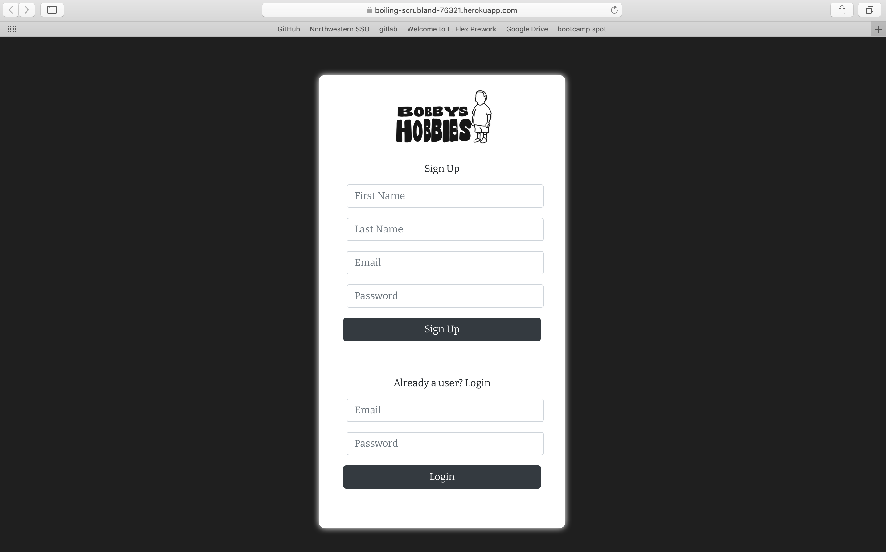

# Bobby's Hobbies

# Genral Info
> A website full of hobbies which allows you to like and post new additions. A way for people to share activities, the cost, detailed description, and uplaod images. Users can keep track of what they have previously liked on the favorites page.

## Table of contents
* [General info](#General-info)
* [Link](#Link)
* [Screenshot](#Screenshot)
* [Technologies](#Technologies)
* [Features](#Features)
* [Credits](#Credits)

## Link
Deployed App: https://boiling-scrubland-76321.herokuapp.com/

## Screenshot

## Technologies
1.React
2.Javascript
3.Bootstrap and Reactstrap
4.Cloudinary (new)
5.Mongodb & Mongoose
6.Express
7.Axios
8.Passport (new)

## Features
1. Like button
2. Favorites page
3. Different categories of hobbies
4. Description of each hobby
5. Users can post their own hobbies
6. Login

## Credits
Copyright 2020 © Erik Tomlinson, Zach Smelcer, Katie Reid-Anderson, Aida Blinstrubyte

